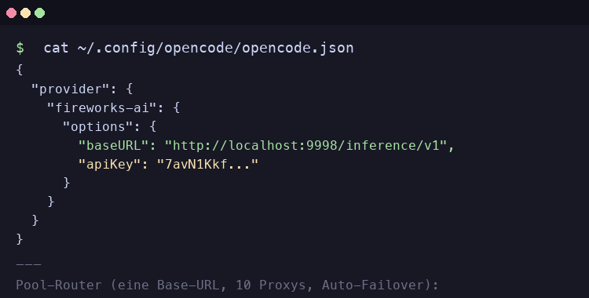

# SINator Dashboard

[](.gitnexus/)

> **⚠️ GitNexus-Pflicht:** Bevor du Code in diesem Repo änderst, MUSST du `gitnexus_impact()` (Blast Radius) und `gitnexus_detect_changes()` (vor Commit) ausführen. Siehe [GitNexus Guide](.gitnexus/).

Web-Dashboard für den SINator Rotator. Verwaltet Fireworks API Keys + HeyPiggy Accounts. Pool-Statistiken, Rotation, Live-Logs.

**[📖 Installationsanleitung](INSTALL.md)** — Schritt-für-Schritt mit Prerequisites-Checks und Verifikation.

## Quick Start (Alles automatisch)

```bash
cd ~/dev/SINator-dashboard
./start.sh
# → Startet Fireworks (:8000) + HeyPiggy (:8002) + Dashboard (:3000) + Tauri App
```

## Nach Code-Änderungen — App neu bauen

```bash
cd ~/dev/SINator-dashboard
./build.sh
# → Next.js export → Tauri build → Installiert nach /Applications/SINator.app
```

**Wichtig:** Die Tauri App ist statisch (kein Hot-Reload). Nach JEDER Änderung an `lib/`, `components/`, `hooks/` oder `app/` muss `./build.sh` laufen, sonst zeigt die App alten Code.

## Seiten

| Seite | URL | Funktion |
|-------|-----|----------|
| Dashboard | `/` | Pool-Stats, Key-Table, "Account/Key holen", Provider-Switcher |
| Rotation | `/rotation` | Einzel-/Loop-Modus, Live-Protokolle |
| Hilfe | `/hilfe` | FAQ + KI-Chat-Assistent |
| Setup | `/setup` | GMX + Fireworks Zugangsdaten konfigurieren |

## Provider

| Provider | Backend | Pool | Status |
|----------|---------|------|--------|
| Fireworks AI | `:8000` | `fireworksai-pool.json` | ✅ Aktiv |
| HeyPiggy | `:8002` | `heypiggy-pool.json` | ✅ Aktiv |
| GitHub | `:8000` | — | 🚧 Vorbereitet |
| Vercel | `:8000` | — | 🚧 Vorbereitet |
| GMX Aliase | `:8000` | — | 🚧 Vorbereitet |

Provider-Switcher oben rechts im Header — HeyPiggy auf PiggyBank Icon (pink) umschalten.

## Features

- **Provider-Switcher**: Fireworks / HeyPiggy / GitHub / Vercel / GMX umschaltbar
- **Key-Table**: Sortier-/Filterbar, Copy-to-Clipboard, Mark-Used, Delete
- **Rotation Panel**: Single / Interval / Target-Count Loop mit Live-Log
- **Pool-Warnung**: Roter Banner wenn weniger als 3 Keys verfügbar
- **Chat-Assistent**: Rust-Command via Pool-Proxy (gpt-oss-120b)
- **Setup**: GMX Email/Passwort + Fireworks Passwort
- **Dark Mode**: System-Theme Auto-Detect

## Remote Setup

**NUR EINE URL** — Pool-Router mit Auto-Failover über 10 Proxys:

```
baseURL: https://sinatorpool-router.delqhi.com/inference/v1
apiKey:  <DEIN_API_KEY>
```

Lokal am Mac: `http://localhost:9998/inference/v1` (ohne API-Key, nur Entwicklung)

Keine einzelnen Pool-URLs mehr. Bei 413/429/412/5xx springt der Router automatisch zum nächsten Proxy.

## OpenCode Config

Öffne `~/.config/opencode/opencode.json` und ergänze den `provider.fireworks-ai` Abschnitt mit der Pool-Router Base-URL:



```json
{
  "provider": {
    "fireworks-ai": {
      "options": {
        "baseURL": "https://sinatorpool-router.delqhi.com/inference/v1",
        "apiKey": "<DEIN_API_KEY>"
      },
      "models": {
        "deepseek-v4-pro": { "id": "fireworks/deepseek-v4-pro" },
        "kimi-k2p6":      { "id": "fireworks/kimi-k2p6" }
      }
    }
  }
}
```

## API-Key Lifecycle & Proxy-Sprung

**Der Pool-Router markiert KEINE Keys als benutzt/gesperrt beim Springen zwischen Proxys.**

| Aktion | Key Status |
|--------|-----------|
| Proxy 1 gibt 412/429/5xx | Router springt zu Proxy 2 → Key bleibt **available** |
| Proxy 2 gibt 412/429/5xx | Router springt zu Proxy 3 → Key bleibt **available** |
| **Alle** 10 Proxys geben selben Fehler | Fehler wird durchgereicht → Key bleibt **available** |
| API gibt echten `suspended`/401/403 Fehler | Key wird als **suspended** markiert |

Ein Proxy-Sprung bedeutet nicht, dass der Key kaputt ist — nur dass der aktuelle Proxy überlastet/ratelimited war.
Erst wenn der API eindeutig sagt "Account suspended" oder "unauthorized", wird der Key als benutzt markiert und aus dem Pool entfernt.

## Tech Stack

- Next.js 16 + React 19 (Static Export)
- TailwindCSS 4 + shadcn/ui
- Tauri v2 (Rust + WebView, Clipboard + Chat Commands)
- Rust: `reqwest`, `tokio`, `futures-util` für Chat-Proxy
- Backend: FastAPI (Python), Playwright-Automation (V15.4)

---

*Stand: 2026-05-31 | V15.4 | SINator-fireworksai Pool: 235 Keys*
